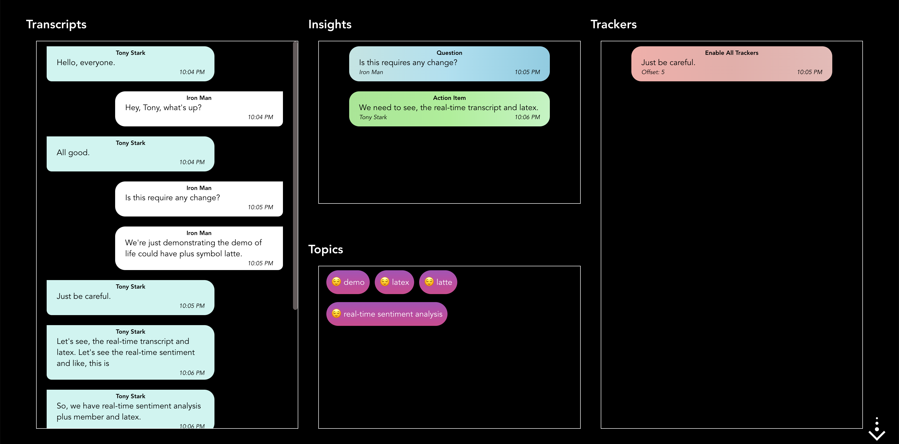
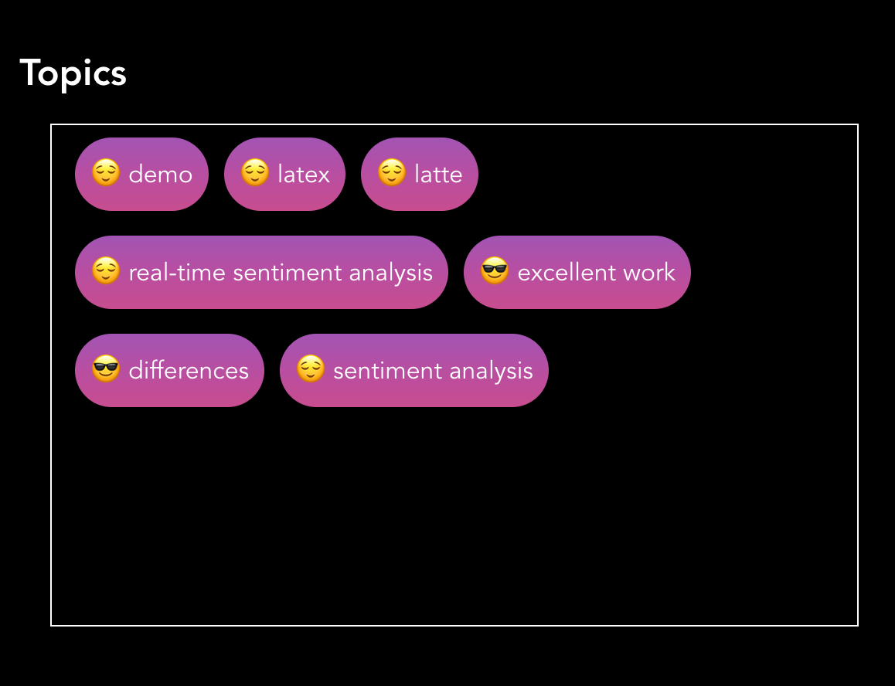
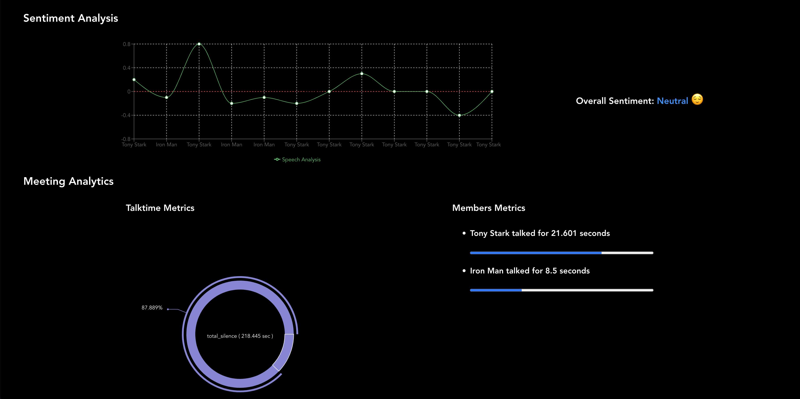
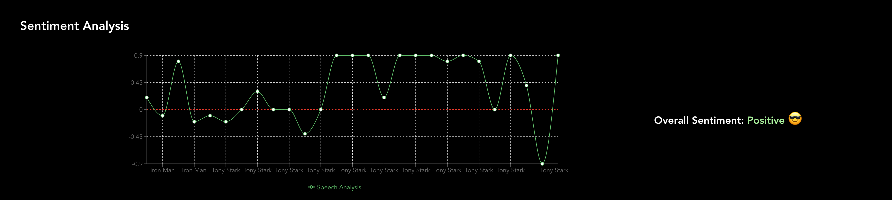

# Reusable React Components

[![Websocket][symbl_websocket_bright_green_badge]][symbl_streaming_api_docs]

Symbl's APIs empower developers to enable:
- **Real-time** analysis of free-flowing discussions to automatically surface highly relevant summary discussion topics, contextual insights, suggestive action items, follow-ups, decisions, and questions.
- **Voice APIs** that makes it easy to add AI-powered conversational intelligence to either [telephony][telephony] or [WebSocket][symbl_streaming_api_docs] interfaces.
- **Conversation APIs** that provides a REST interface for managing and processing your conversation data.
- **Summary UI** with a fully customizable and editable reference experience that indexes a searchable transcript and shows generated actionable insights, topics, timecodes, and speaker information.

<hr />


## Table of Contents
- [Introduction](#introduction)
- [Features](#features)
- [Pre-requisites](#pre-requisites)
- [Installation](#installation)
    - [Setup](#setup)
    - [Run Locally](#run-locally)
- [Usage](#usage)
- [Screenshots](#screenshots)
- [Community](#community)
- [License](#license)

## Introduction
This repository contains the reusable components for React JS which can be used to reduce the overall integration time.

## Features
This extension provides the following out-of-the-box conversational intelligence features:

- **Live Closed Captioning**: Live closed captioning is enabled by default and provides a real-time transcription of your audio content.
- **Real-time Transcription**: Symbl offers state-of-the-art Speech-to-Text capability (also called transcription). You can get audio and video conversations transcriptions in real-time.
- **Real-time Insights**: Symbl allows you to get the real-time insights (action items, questions and follow ups) of the conversations.
- **Real-time Topics with sentiments**: Symbl allows you to get the real-time topics of the conversations along with their sentiments.
- **Real-time Trackers detection**: Symbl allows real-time detection of the trackers in the conversation.
- **Real-time Sentiment Analysis of the conversations**: Symbl allows you to get real-time sentiment analysis (sentence level) and aggregated/overall sentiment categorisation of the conversations.
- **Real-time Meeting metrics**: Symbl allows you to get real-time analytics of `total talktime`, `total silence` and `total overlapping time` of the meeting.
- **Real-time Member metrics**: Demonstrates the `talktime` or contribution of a member in the conversations.

## Pre-requisites

- [Node JS (version 14+)](node_js_download_link)
- [Symbl Account][symbl_signup]

## Installation

### Setup

1. Clone the project

    ```bash
    git clone https://github.com/SymblDev/reusable-react-components.git
    ```

2. Go to the project directory

    ```bash
    cd reusable-react-components
    ```
3. Copy the `symbl` folder.

    ```text
    project
      │   symbl
      │   README.md    
      │   ...
    ```
   
4. Navigate to the project to which Symbl powers needs to be integrated

5. Paste the `symbl` folder copied in step 3, in the project's `src` directory.

    ```text
    target-react-project
      │   public
      │   src
           │   symbl    <---
           │   App.js
           │   index.tsx
           │   index.css
      │   package.json
      │   package-lock.json
      │   README.md
      │   ...
    ```

6. Install dependencies

    ```bash
    npm install recharts
    npm install        
    ```
   > **Note**: 'recharts' is required to show the graphical representation of the insights

### Run Locally
1. Navigate to the `src/symbl/config/` directory and open the `config.js` file.
2. Add your Symbl `App Id` and `App Secret` values in the respective fields below:

    ```javascript
   appId: '',
   appSecret: ''
   ```

3. Modify the rest of the configuration such as Trackers, Sentiment Analytics as per requirements. [Optional]

    ```javascript
    realtimeSentimentAnalysis: true,
    realtimeAnalyticsMetric: true,
    trackers: [
      {
        name: "Promotion Mention",
        vocabulary: [
         "We have a special promotion going on if you book this before",
         "I can offer you a discount of 10 20 percent you being a new customer for us",
         "We have our month special this month",
         "We have a sale right now on"
        ]
      }
    ]
    ```

4. Start the application.
    ```npm
    npm start
    ```
The application will be started at [http://localhost:3000](http://localhost:3000)

## Usage

The magic provided by Symbl can be utilized in the following ways:-

- ### Hooks
    Symbl capabilities can be utilized using the `useSymbl` hook. It provides all the [features](#features) out of the box.
    \
    But in order to get real-time conversation insights a user has to provide some configuration details while initializing the connection with Symbl.
    \
    \
    The configuration details are as follows:-
  - **Meeting Id**: Unique Identifier of the meeting.
  - **Meeting Name**: Name of the meeting.
  - **Participant Id**: Unique Identifies of the local participant `(e.g- 9334785, abcd@test.com, ...)`
  - **Participant Name**: Name of the local participant who wants to join the meeting.
  - **Audio Stream**: A `MediaStream` object which refers to the audio stream of the local participant.

    ```javascript
    const getSymblConfig = async () => {
        const stream: MediaStream = await navigator.mediaDevices.getUserMedia({audio: true, video: false});
        const participantId = 'vishal@symbl.ai';
        const participantName = 'Vishal';
        const meetingId = '4eee04f1f66318c659d02949e2f4f7fb946521bdfe11181423795565850c92f4'
        const meetingName = 'Demo Meeting';
        return {meetingId, meetingName, participantId, participantName, stream};
    }
    ```
    
    <br>
    
    #### Usage of Hook
  - To get the real-time closed captions.
  
    ```javascript
    const { closedCaption } = useSymbl(symblConfig);
    ```
    
  - To get the real-time transcripts.

    ```javascript
    const { transcripts } = useSymbl(symblConfig);
    ```
    
  - To get the real-time messages with sentiment score.

    ```javascript
    const { messagesWithSentiment } = useSymbl(symblConfig);
    ```
    
  In order to get all the features we can simply destructure the required fields from `useSymbl` hook. 

    ```javascript
    const {
        closedCaption,
        transcripts,
        insights,
        topics,
        trackers,
        messagesWithSentiment,
        analyticsMetric,
        muteSymbl,
        unmuteSymbl,
        stopSymbl
    } = useSymbl(symblConfig);
    ```
  
    > **Note**: `muteSymbl`, `unmuteSymbl` and `stopSymbl` are the methods that provides mute, unmute and stop the Symbl connection functionality out of the box

- ### Components
    Using the `useSymbl` hook, we can easily integrate Symbl capabilities in our app within minutes.
    \
    But in order to display the magical results that we get from Symbl (closed captions, sentiment analysis, ...), we need to create some user interfaces.
    \
    \
    There comes the `<Symbl />` component to rescue.

    <br>
    
    #### Usage of Components

  - To display the real-time closed captions.
    
    ```javascript
    <Symbl closedCaption={closedCaption} />
    ```
    
  - To display the real-time message transcripts.

    ```javascript
    <Symbl 
        closedCaption={closedCaption} 
        transcripts={transcripts} 
    />
    ```
    
  - To display the real-time messages with sentiment score.

    ```javascript
    <Symbl 
        closedCaption={closedCaption}
        messagesWithSentiment={messagesWithSentiment} 
    />
    ```
  
    > **Note**: Closed Captions are mandatory by default, so they are required to be passed to `<Symbl />` component.
    
  In order to display all the features we can simply pass the required details to `<Symbl />` component which we get from `useSymbl` hook.

    ```javascript
    <Symbl
        closedCaption={closedCaption}
        transcripts={transcripts}
        insights={insights}
        topics={topics}
        trackers={trackers}
        messagesWithSentiment={messagesWithSentiment}
        analyticsMetric={analyticsMetric}
    />
    ```
  
  <br>

  > ### Modification of the components and styling changes
  > Each and every component has two primary files in it, `.js` file for making logical changes to component and `.css` file for styling changes of the component.
  > ```text
  > Tracker
  >   │   Tracker.js
  >   │   styles.css
  > ```
  > 
  > These files can be changed for any CSS styling or logical changes to components according to your needs.
 

## Screenshots

- Live Closed Captioning
  >  

- Real-time Transcripts, Insights (Action Items, Questions and Follow Ups), Topics and Trackers
  >  

- Real-time Topics with sentiments
  >  

- Sentiment and Meeting Analytics
  >  

- Sentiment Analysis with overall sentiment
  >  

## Community

If you have any questions, feel free to reach out to us at `devrelations@symbl.ai` or through our [Community Slack][slack] or our [forum][developer_community].

This guide is actively developed, and we love to hear from you! Please feel free to [create an issue][issues] or [open a pull request][pulls] with your questions, comments, suggestions, and feedback. If you liked our integration guide, please star our repo!


[symbl_websocket_bright_green_badge]: https://img.shields.io/badge/symbl-websocket-brightgreen
[telephony]: https://docs.symbl.ai/docs/telephony/overview/post-api
[symbl_streaming_api_docs]: https://docs.symbl.ai/docs/streamingapi/overview/introduction
[developer_community]: https://community.symbl.ai/?_ga=2.134156042.526040298.1609788827-1505817196.1609788827
[slack]: https://join.slack.com/t/symbldotai/shared_invite/zt-4sic2s11-D3x496pll8UHSJ89cm78CA
[issues]: https://github.com/SymblDev/reusable-react-components/issues
[pulls]: https://github.com/SymblDev/reusable-react-components/pulls
[node_js_download_link]: https://nodejs.org/en/download/
[symbl_signup]: https://platform.symbl.ai/#/signup?utm_source=get-info&utm_medium=marcelo&utm_campaign=rep
[create_react_app_link]: https://github.com/facebook/create-react-app